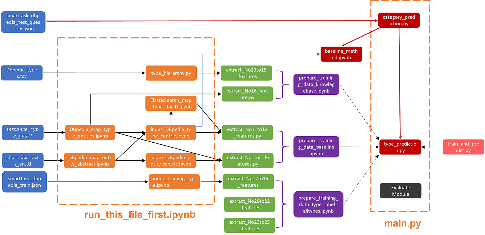

# dat640-smart-task

## Instruction for running run this project

1. Download [short_abstracts_en.ttl](http://downloads.dbpedia.org/2016-10/core-i18n/en/short_abstracts_en.ttl.bz2) and
   [instance_types_en.ttl](http://downloads.dbpedia.org/2016-10/core-i18n/en/instance_types_en.ttl.bz2).
2. Extract these two files in the directory: `advanced-type-prediction/data`.
3. Make sure the elasticsearch engine is running in your machine.
4. Change directory to `advanced-type-prediction` with `cd .\advanced-type-prediction\`.
5. Run `run_this_file_first.ipynb`. (This will generate the needed files and index 3 datasets into elasticsearch. )
6. Change directory to root folder with `cd ..` and run `main.py`.

`Note:` If you want to check most of the file generated as well as the trained model. Please [download](https://liveuis-my.sharepoint.com/:u:/g/personal/261410_uis_no/EXvz-Q2g_HlNqGG8U1qTYkMBQwQexATC7-Gi946tXGjzfg) with password `111111`.

## Output files

The output files `category_results.json`, `baseline_results.json` and `advanced_results.json` are provided in the root folder. These will be loaded in `main.py` if they exist, and generated by running `main.py` if removed, and then used in the evaluation functions.

## Possible solutions for errors during runing the project

1. Make sure to use 64 bits python.
2. Update the python elasticsearch liabrary to a newer version.

## Overview of the project

